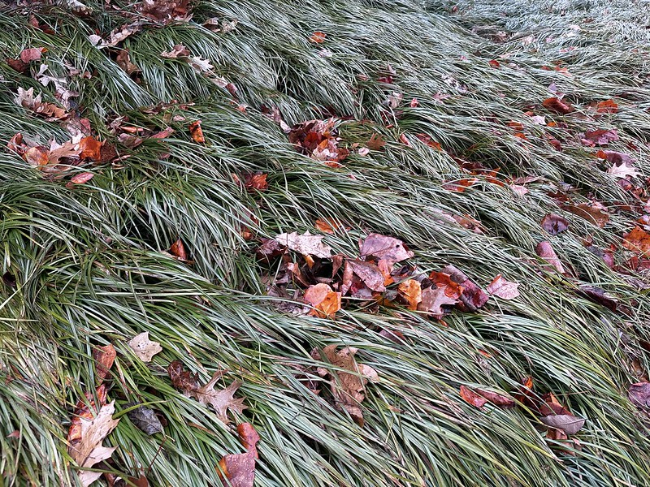

 [English](index.md) / Français 

***Bienvenue dans ma webpage!***

Je suis un étudiant senior à l'Université de Nankin à la Chine, majeur au mathématique. Dans ma troixième année, J'ai visité l'University of Wisconsin-Madison aux Etates Unis où j'ai étudié dans le thematic track de mathématique et dans l'école de la musique. Mon intéret du mathématique reste dans l'algèbre et le géométrie. J'aime aussi le violoncelle, le piano, photographie, literature and plus.

[Courier](mailto:y3210283@gmail.com) / [CV](./CV-FENG Yuekun-1.docx)

## Quelques travaux au mathématique

### *récherche:*

(encore de preparation) C'est une [survey](./intersection.pdf) (en anglais) sur des topics en géométrie algebrique.

2025.10 C'est une [survey](./representation.pdf) (en anglais) sur les répresentations de groupes symmetrics.

2025.8 J'ai participé à une récherche d'été sur les modèles lattices et la théorie de répresentation. C'est une [reportage](./report.pdf), un [poster](./poster.pdf), et une [draft de survey](./draft of survey.pdf) (toutes en anglais).

### *les notes des lectures et des devoirs:*

2025 fall: [modular forms](mf.md) (graduate) / algebraic geometry (graduate) / representation theory

2025 summer: Lie groups

2025 spring: [commutative algebra](ca.md) (graduate) / [functional analysis](fa.md) (graduate) / [algebraic topology](at.md) / [differential geometry](dg.md)

2024 fall: real analysis (graduate)

2024 summer: introduction to manifolds

## Quelques travaux a la musique

Je travail couranment en *le projet de Bach* commencé de 2022.

(encore de préparation) J.S. Bach : suite no.5 pour le violoncelle unaccompanié dans c minuer, BWV1011

2025.5 C. Cobley : [Navidson Record](https://www.flipsnack.com/uwmadisonmusic/124dancavanagh-digital.html) (première du monde ! )

2024.6 L.V. Beethoven : sonate no.3 pour piano et violoncelle dans A majeur, [Op.69](https://www.bilibili.com/video/BV1DsGoeKEyD/)

2024.6 J.S. Bach : suite no.4 pour le violoncelle unaccompanié dans E-Flat majeur, [BWV1010](https://youtu.be/Ue5jIKf0E4A)

2023.12 J.S. Bach : suite no.3 pour le violoncelle unaccompanié dans C majeur, [BWV1009](https://youtu.be/pdTsVM8-kdo)

2023.5 J.S. Bach : suite no.2 pour le violoncelle unaccompanié dans d mineur, [BWV1008](https://youtu.be/V0qSKLKkbPI)

2022.12 J.S. Bach : suite no.1 pour le violoncelle unaccompanié dans G majeur, [BWV1007](https://youtu.be/UHCd3QYutXc) 

## Quelques photographies

[Flickr](https://www.flickr.com/people/201311233@N05/)

2025.5 avec le [studio de violoncelle](cello studio.jpg) à l'Eglise Grace Episcopal à Madison

2024.6 avec l['équipe du violoncelle](xiangyang) à l'Exhibition d'Art Nationnelle à Xiangyang

2024.5 avec les [violoncelles](changsha.jpg) de l'Orchestre Synphonique d'Université Hunan à la Théatre Hunan Grande à Changsha

