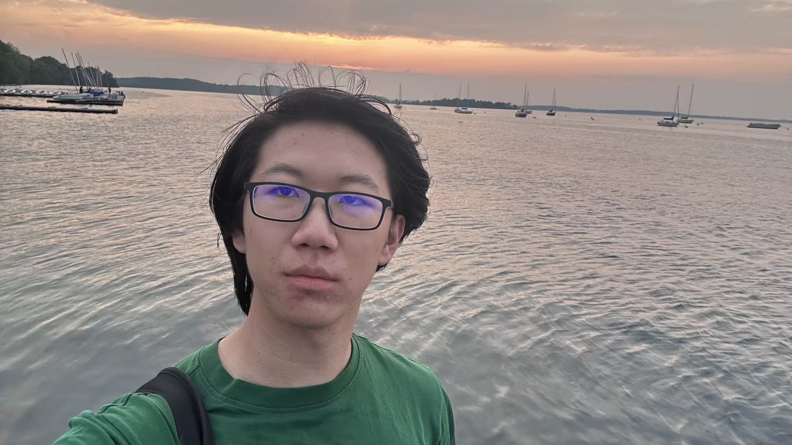

***Welcome to my webpage!***

I am a senior undergraduate student at Nanjing University in China, majoring in mathematics. In my junior year, I visited University of Wisconsin-Madison in the United States where I studied in both the thematic track of mathematics and in the music school. My math interest lies in algebra and geometry. I also like cello, piano, photography and more.

[Email](mailto:y3210283@gmail.com) / [CV](./Resume.pdf)

## Some math works

### *research:*

(preparing) This is a [survey](./intersection.pdf) on topics in algebraic geometry.

2025.10 This is a [survey](./representation.pdf) on symmetric group representations.

2025.8 I attended a summer research in lattice models and representation theory. This is a [report](./report.pdf), a [poster](./poster.pdf), and a [draft of survey](./draft_of_survey.pdf).

2024.2 I worked with a team in AI using tools from random forest and developed a [paper](./model.pdf).

### *lecture notes and homework notes:*

2025 fall: [modular forms](mf.md) (graduate) / algebraic geometry (graduate) / representation theory

2025 summer: Lie groups

2025 spring: [commutative algebra](ca.md) (graduate) / [functional analysis](fa.md) (graduate) / [algebraic topology](at.md) / [differential geometry](dg.md)

2024 fall: real analysis (graduate)

2024 summer: introduction to manifolds

## Some music works

I am currently working on *the Bach project* started from 2022.

(preparing) J.S. Bach: Suite No.5 for Unaccompanied Cello in c Minor, BWV1011

2025.5 C. Cobley: [Navidson Record](https://www.flipsnack.com/uwmadisonmusic/124dancavanagh-digital.html) (world premiere!)

2024.6 L.V. Beethoven: Sonata No.3 for Piano and Cello in A Major, [Op.69](https://www.bilibili.com/video/BV1DsGoeKEyD/)

2024.6 J.S. Bach: Suite No.4 for Unaccompanied Cello in E-Flat Major, [BWV1010](https://youtu.be/Ue5jIKf0E4A)

2023.12 J.S. Bach: Suite No.3 for Unaccompanied Cello in C Major, [BWV1009](https://youtu.be/pdTsVM8-kdo)

2023.5 J.S. Bach: Suite No.2 for Unaccompanied Cello in d Minor, [BWV1008](https://youtu.be/V0qSKLKkbPI)

2022.12 J.S. Bach: Suite No.1 for Unaccompanied Cello in G Major, [BWV1007](https://youtu.be/UHCd3QYutXc) 

## Some pictures

[Flickr](https://www.flickr.com/people/201311233@N05/)

2025.5 with the [Cello Studio](cello studio.jpg) at the Grace Episcopal Church at Madison

2024.6 with the [cello team](xiangyang.jpg) at the National Art Exhibition at Xiangyang

2024.5 with the [cellos](changsha.jpg) of Hunan University Symphony Orchestra at the Hunan Grand Theater at Changsha

